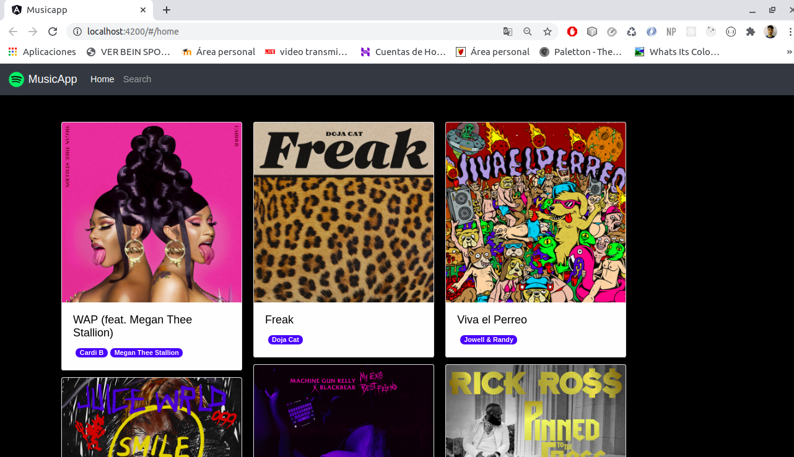
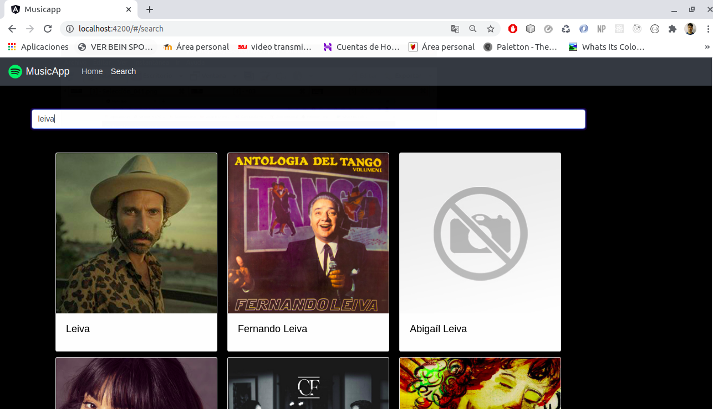
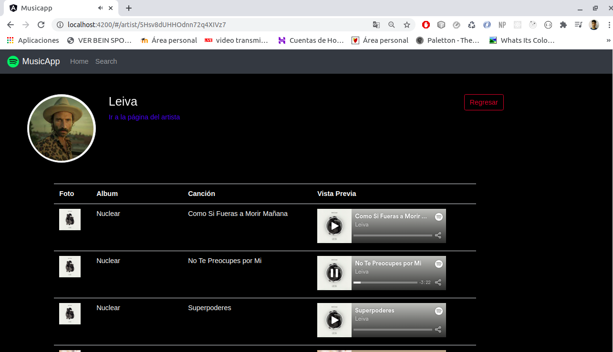

# MusicApp

_Proyecto realizado con Angular, consumiento la API de Spotify.

En la página principal muestra los albúnes Top del momento, se pueden realizar búsquedas por albúnes o artistas y reproducir sus canciones._


## Comenzando 🚀

_Para obtener una copia del proyecto en funcionamiento en tu máquina local para propósitos de desarrollo y pruebas, necesitaras descargarlo o clonar el repositorio a tu máquina._


### Tecnologías🛠️

Programas y Frameworks utilizados para el desarrollo y pruebas del proyecto:

* [VSCode] - Editor de código usado - (https://code.visualstudio.com/).
* [Angular] - Framework de desarrollo.
* [Bootstrap] - Es un frameword de diseño;
* [GitHub] - Control de versiones.


### Instalación 🔧

Una vez descargado, descomprimido y ubicado en el directorio del proyecto, instale las dependencias y devDependencies.

```sh
$ npm install
```

Inicie el servidor

```sh
$ ng serve
```

Las instrucciones sobre cómo usarlas en su propia aplicación están vinculadas a continuación.
GitHub  [plugins/github/README.md][PlGh] 


## Video
(https://youtu.be/OJkOs7VWbHc)


## Imagenes






## Wiki 📖

Puedes encontrar mucho más de cómo utilizar este proyecto en nuestra [Wiki](https://github.com/jocamo00/Angular_Proyecto_MusicApp)

## Versionado 📌

Usamos [GitHub](https://github.com/) para el versionado. Para todas las versiones disponibles, mira los [tags en este repositorio](https://github.com/jocamo00/Angular_Proyecto_MusicApp).

## Autor ✒️

* **Jose Carreres** - [jocamo00](https://github.com/jocamo00)


